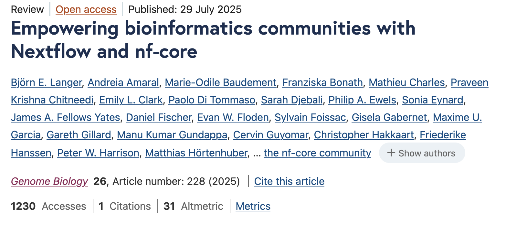
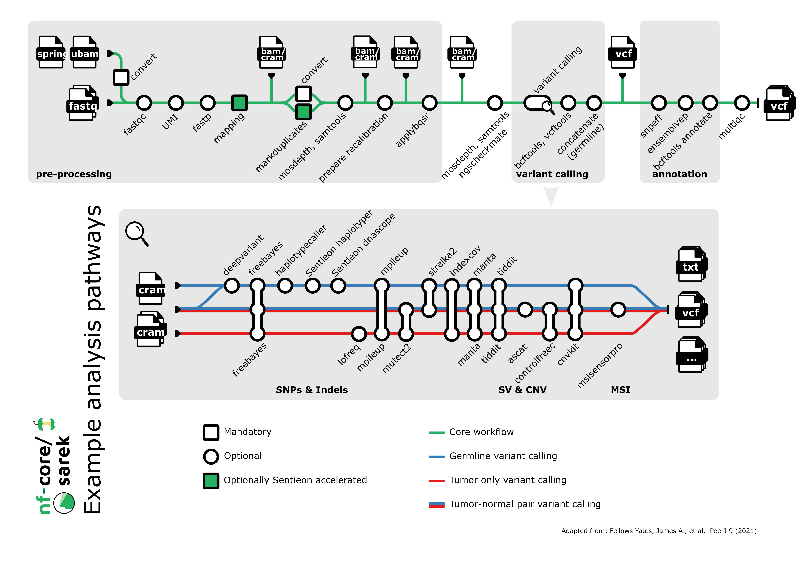
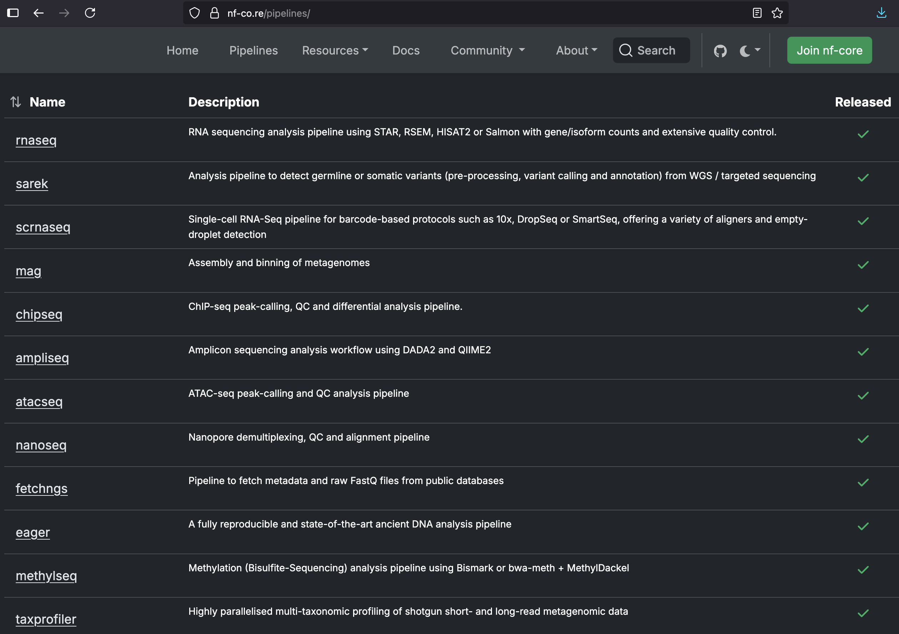

## Introducción

- Bioinformático especializado en oncogenómica.
- Experiencia en sistemas de información para la salud (HIS).
- Experiencia en análisis de datos ómicos en cáncer.
- Enfoque: reproducibilidad y escalabilidad en análisis bioinformático.

<div style="
  display: flex; 
  justify-content: space-evenly; 
  align-items: center; 
  gap: 10px; 
  width: 100%; 
  flex-wrap: nowrap;
  margin-top: 20px;
">
  
  
  
</div>


## ¿Qué es una pipeline?

- Secuencia de pasos para procesar y analizar datos.
- Garantiza **reproducibilidad** y **automatización**.
- Escalable a grandes volúmenes de datos.

> En oncología, cada dataset puede tener **miles de muestras**.

<div style="
  display: flex; 
  justify-content: center; 
  align-items: center; 
">
  
</div>

---

## Problemas comunes sin pipelines

- Procesos manuales y propensos a errores.
- Dificultad para reproducir resultados.
- Escasa portabilidad entre entornos.
- Problemas de escalabilidad.
- Falta de estandarización.

---

## ¿Qué es Nextflow?

- Gestor de flujos de trabajo (workflow manager).
- Reproducible, portátil y escalable.
- Compatible con:
  - **Docker / Singularity**
  - **HPC (SLURM, PBS)**
  - **Cloud (AWS, Google Cloud)**

<div style="
  display: flex; 
  justify-content: center; 
  align-items: center; 
">
  
</div>
---

## Filosofía de Nextflow

> "Write once, run anywhere"

- Código y datos versionados.
- Entornos aislados para evitar conflictos.
- Ejecución paralela optimizada.
- Escalabilidad inteligente.
- Modularidad y mantenibilidad.
- Transparencia y trazabilidad.

---

## ¿Qué es nf-core?

- Comunidad que desarrolla pipelines bioinformáticas estandarizadas.
- Buenas prácticas + documentación clara.
- Validación continua (CI/CD).

<div style="
  display: flex; 
  justify-content: center; 
  align-items: center; 
">
  
</div>

---

## Ejemplos en oncología

- **nf-core/sarek** → Análisis de variantes somáticas y germinales.
- **nf-core/rnaseq** → Análisis de expresión génica.
- **nf-core/scrnaseq** → Transcriptómica de célula única.

<div style="
  display: flex; 
  justify-content: center; 
  align-items: center; 
">
  
</div>
---

## nf-core/sarek
<div style="
  display: flex; 
  justify-content: center; 
  align-items: center; 
">
  
</div>

## Caso de uso: Sarek

1. **Entrada:** FASTQ o BAM.
2. **Procesamiento:** QC, alineamiento, llamado de variantes.
3. **Salida:** Archivos VCF y reportes multiQC.

Beneficios:
- Reproducible en cualquier entorno.
- Escalable a grandes cohortes.

---

## Ejemplo rápido

Comando

```bash
nextflow run nf-core/sarek \
  --input samplesheet.csv \
  --genome GRCh38 \
  -profile docker
```
Samplesheet

```csv
patient,sex,status,sample,lane,fastq_1,fastq_2
patient1,XX,0,normal_sample,lane_1,test_L001_1.fastq.gz,test_L001_2.fastq.gz
patient1,XX,0,normal_sample,lane_2,test_L002_1.fastq.gz,test_L002_2.fastq.gz
patient1,XX,0,normal_sample,lane_3,test_L003_1.fastq.gz,test_L003_2.fastq.gz
patient1,XX,1,tumor_sample,lane_1,test2_L001_1.fastq.gz,test2_L001_2.fastq.gz
patient1,XX,1,tumor_sample,lane_2,test2_L002_1.fastq.gz,test2_L002_2.fastq.gz
patient1,XX,1,relapse_sample,lane_1,test3_L001_1.fastq.gz,test3_L001_2.fastq.gz
```

## Más información

- [https://nf-co.re](https://nf-co.re)
- Introducción
- Uso
- Parametros
- Salidas
- Resultados
- Lanzamientos - Versions

## Pipelines

<div style="
  display: flex; 
  justify-content: center; 
  align-items: center; 
">
  
</div>

## Contacto
- [https://www.linkedin.com/in/oliver-mazariegos/](https://www.linkedin.com/in/oliver-mazariegos/)
<div style="
  display: flex; 
  justify-content: center; 
  align-items: center; 
">
  
</div>